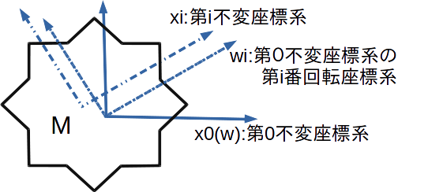
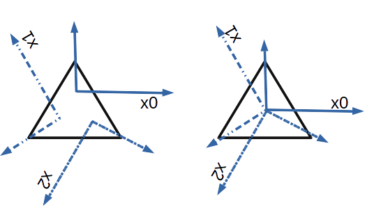
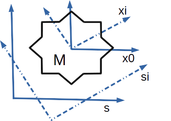

# The estimation method of the symmetry axis in point clouds

## 目的

回転対称物体の認識にてソルバーは必ずしも最小の回転を算出しない。回転対称物体での回転の最小化は後処理が必要である。

## 回転対称物体の特徴不変座標系  

### 特徴不変座標系の定義  
- 2つ以上の異なる座標系xiから観測した物体Mの特徴点が一致するとき、座標系xiを物体Mの特徴不変座標系という  
### 定理  
- N相対称の物体は、少なくともN個の特徴不変座標系を持つ

### 特徴不変座標系の求め方  
N相対称の物体Mがある。最初に座標系x0として、物体Mの重心を通る座標系wを与える。これにより座標系x0(w)は、物体Mの回転軸に近いと仮回転軸と考えて良い。

1. 不変座標系  
x0を基準とした不変座標系xiへの変換行列は以下のように表される  
&nbsp;&nbsp;&nbsp;&nbsp;x0Txi  
この変換にて物体Mをx0座標系上で移動させると以下となる  
&nbsp;&nbsp;&nbsp;&nbsp;Mxi=x0TxiM

2. 仮回転座標系  
座標系x0(w)を原点周りに第i相回転させた座標系をwiとする。wiは仮の回転軸で回転となる。x0基準とした変換は以下のよう表される。  
&nbsp;&nbsp;&nbsp;&nbsp;x0Twi
またこの変換により、物体Mは以下のように移動させる  
&nbsp;&nbsp;&nbsp;&nbsp;Mwi=x0TwiM

3. ICP変換  
wiは仮の回転軸であるため、Futures(Mwi)とFutures(Mxi)は一致しないが、近いところにあるのでICPなどで、差を求めることが出来る。
また、Futures(Mxi)=Futures(M)のため、MwiとM( or Mの0相回転)でICPを行えば良い。これにより  
&nbsp;&nbsp;&nbsp;&nbsp;x0Ticp  
が得られたとする。これより下式を得る。  
&nbsp;&nbsp;&nbsp;&nbsp;x0TxiM=x0Ticpx0TwiM
or  
&nbsp;&nbsp;&nbsp;&nbsp;x0Txi=x0Ticpx0Twi

### 固有不変座標系
  
前述の手順にて得られた特徴不変座標系は、x0を重心を通る座標系として与えたので、必ずしも物体Mの対称軸には一致せず、またそれぞれの原点も異なる(上図左)。不変座標系のうち
<ul>
<li>その原点が全て同一
<li>回転軸が同一
</ul>
であるものを固有不変座標系と呼ぶ(上図右)。「回転軸が同一」の条件は、例えば回転軸を座標系のZ軸とすれば、該座標系の全てのZ基底ベクトルが同一と言い換えられる。

### 固有不変座標系の求め方  
不変座標系xiから、固有不変座標系は容易に求められる。簡単のためZ軸を対称軸として手順を示す
<ul>
<li>第0不変座標系x0のZ軸を、全ての不変座標系xiのZ基底ベクトル和と同じ向きに回転させる
<li>第0不変座標系x0の原点を、全ての不変座標系xiの原点の重心に移動させる
</ul>
これによって得られた、新たな第0不変座標系x0を元に、不変座標系xiを求める。  
これを必要な精度が得られるまで、繰り返してもよい。

### 基準座標系の変更  
  
以上、物体基準にて不変座標系を求めたが、実用上は原点は自由に定めたい。例えばカメラ座標系を基準にするなどである。上図のようにs座標系を基準とするには  
&nbsp;&nbsp;&nbsp;&nbsp;sTsi=sTx0x0TxixiTsi  
にてs座標系基準にてN個の不変座標系siに展開できる。  
上式で、xiTsiは不変座標系の定義より  
&nbsp;&nbsp;&nbsp;&nbsp;siTxi=sTx0  
であるので、整理すると  
&nbsp;&nbsp;&nbsp;&nbsp;sTsi=sTx0x0Txix0Ts  

## テストコード  
サンプルデータsurface.plyは3相対称な点群データである。座標系はカメラ座標系を基準としている。  
test.pyは上記手順にてsTsiを求め、これにより元の点群データから120度240度回転の点群データを作り、元のデータを合わせ３セットの点群を重ね描きしている。

## 解析結果の加工  
sTsiが得られれば、解析結果cTsに対して、不変座標系展開も容易である  
&nbsp;&nbsp;&nbsp;&nbsp;cTsi=cTssTsi  
cTsiの回転部分の回転量が最小のものを選ぶ。
